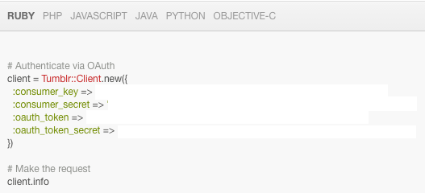
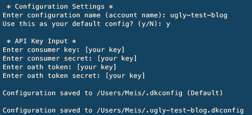

  
DraftKing is not associated with Tumblr  
[](https://badge.fury.io/rb/tumblr_draftking)
[](https://codeclimate.com/github/meissadia/tumblr_draftking)
[](https://codeclimate.com/github/meissadia/tumblr_draftking/coverage)

DraftKing for Tumblr takes the hassle out of managing your draft queue!  
+ **(New!) [Auto-Poster](#auto-poster): Publish up to 200 posts a day!**
+ **Save and name your own [DK commands](#custom-commands)!**
+ **Automate the addition of comments and tags.**
+ **Strip away old comments.**
+ **Easily replenish your queue.**
+ **Randomize post order to add variety.**
+ **Manage multiple accounts.**

Version 0.8.3
+ New! (Auto-Poster) Publish up to 200 posts per 24 hours!

+ Please report any [issues] you encounter!
+ [Change Log](./CHANGELOG.md)

## Table of Contents
+ [Installation](#installation)
+ [Setup](#setup)
	+ [1. Register an app](#1.-register-an-app)
	+ [2. Get oauth_token and oauth_token_secret](#2.-get-oauth_token-and-oauth_token_secret)
	+ [3. Run setup](#3.-run-setup)
+ [Usage](#usage)
	+ [Command Line Interface](#command-line-interface)
		+ [Custom Commands](#custom-commands)
		+ [My Workflow](#my-workflow)
		+ [Examples](#examples)
			+ [Configured Accounts](#configured-accounts)
			+ [Blog list](#blog-list)
			+ [Commenting](#commenting)
			+ [Drafts or Queue](#drafts-or-queue)
			+ [Stripping Comments](#stripping-comments)
			+ [Comment & Move](#comment-&-move)
			+ [Auto-Poster](#auto-poster)
		+ [Testing Console](#testing-console)
	+ [API](#api)
+ [Built With](#built-with)
+ [Test Suite](#test-suite)
+ [Contributing](#contributing)


## Installation

    $ gem install tumblr_draftking

## Setup

### 1. Register an app
https://www.tumblr.com/oauth/apps  
+ **Application Name:** DraftKing
+ **Application Description:** [anything]
+ **Administrative contact email:** [your email address]
+ **Default callback URL:** [any url]

Once registered you should see your Consumer Key and Secret Key:

<br/>
<br/>
### 2. Get oauth_token and oauth_token_secret
Using your Consumer Key and Secret Key from above, access https://api.tumblr.com/console/calls/user/info  

<br/>
<br/>
### 3. Run setup
```ruby
$ dk setup
```

Setup will walk you through saving your configuration for future use.


<br/>
<br/>
## Usage

### Command Line Interface

The CLI will walk you through connecting to your Tumblr account the first time it's run.

* See: [Setup]

Once you've got that configured, check the help to familiarize yourself with your options.

```ruby
$ dk -h
```

#### Custom Commands
You can store your DK commands in your configuration file's (i.e. ~/.dkconfig) user_commands array.  

Configuration file with two custom commands: tag_with_cool & show_other_account_status
```
---
:config_name: utb
:api_keys:
  consumer_key: [your_consumer_key]
  consumer_secret: [your_consumer_secret]
  oauth_token: [your_oauth_token]
  oauth_token_secret: [your_oauth_token_secret]
:user_commands:
  tag_with_cool:
    command: dk tag -t cool -c cool
    description: Add the tag and comment 'cool' to posts
    config_name: utb
  show_other_account_status:
    command: dk status --config account2
    description: Show the status blogs under account2
    config_name: account2
```

Trigger custom command example:
```
$> dk tag_with_cool
```


#### My Workflow
I manually add comments for posts where I want more detail, using a separator ( / | , \ ) to identify tags.  
+ These tags/comment will not be removed by dk.

```
  ~MD~ | architecture | landscape | blue | yams |
```

Then I'll let DraftKing automatically comment and tag the rest, strip old comments, and move them to my queue.
```
$ dk md -c ~MD~
```
  * It will preserve post comments which already contain the string passed via `-c ~MD~`, so I don't need to worry about overwriting my special cases.  
  * It will also generate tags from the comment.  In the above case you would get: #architecture #landscape #blue #yams (the comment in not added as a tag)

And that's it, my queue is loaded with manicured posts!

By default dk will act on your primary blog. To target an secondary blog, specify it using `-b <blog name>`
<br/>
<br/>

####  Examples

##### Configured Accounts
```ruby
$ dk accounts

#> * ---- Accounts ---- *
#>     0. (Default)
#>     1. ugly-test-blog
#>     2. nice-test-blog
```

The default account is the configuration used when calling dk.  
If the default doesn't exists, the first available configuration will be used.

To use an alternate account: `$dk accounts -s` . A dialog will help you set it as the default.  
To delete an account configuration: `$dk accounts -d` . A dialog will let you choose which one.
<br/>
<br/>
##### Blog list
```ruby
$ dk blogs
#> #-------- Blogs --------#
#> 1. 'primary-blog-name'
#> 2. 'second-blog-name'

```
##### Commenting
- Add the comment "dude, where's my car?"
- Target primary blog
- Apply to Drafts
- Keep existing tags (-k)
- Keep existing comments (-K)

```ruby
$ dk comment -c "dude, where's my car?" -k -K

#> Adding draft comment "dude, where's my car?": 32 / 32 [100%]

```
##### Drafts or Queue  
- Add the comment 'where\'s your car, dude?'
- Target primary blog
- Apply to Queue (--source q)
- Limit action to 42 posts (-l 42)
- Remove old comments


```ruby
$ dk comment -c "where's your car, dude?" --source q -l 42

#> Adding queue comment "where's your car, dude?": 32 / 32 [100%]

```
##### Stripping Comments
- Remove old comments
- Apply to Drafts
- Target 'second-blog-name' (-b second-blog-name)
- Simulate (-s)

```ruby
$ dk strip -b second-blog-name -s

#> Stripping previous comments: 113 / 113 [100%]

```
##### Comment & Move
- Add the comment "draftking for tumblr"
- Target primary blog
- Apply to Drafts
- Generate tags from comment for posts with a comment already containing 'tumblr_draftking'
- Keep existing tags (-k)
- Add tags #new, #tags, #to, #add
- Remove old comments
- Move posts to the Queue.  
- Suppress progress message (-m)

```ruby
$ dk md -c "draftking for tumblr" -k -t new,tags,to,add -m
```

##### Auto-Poster
- Publish from the Drafts (-s)
- Add the comment "draftking auto poster" (-c)
- Target blog named 'test-blog' (-b)
- Keep existing tags (-k)
- Remove old comments (default behavior)
- Add tags #new, #tags, #to, #add (-t)

```ruby
$ dk ap -b 'test-blog' -c 'draftking auto poster' -k -t 'new,tags,to,add' -s :drafts
```

#### Testing Console
The dk console can act as a sandbox while you explore the api or you can use it to actively manage your account.  
By default it runs in simulation mode so any changes you make will not affect your account.

```ruby
$ dk console
irb:> $dk.status
irb:> $dk.strip_old_comments

# Switch to live mode
irb:> $dk.simulate = false

```

### API
By default, API Keys are read from ~/\*.dkconfig (See: [Setup]) or you can pass them at the time of Client creation.

```ruby
require 'tumblr_draftking'

# Use default configuration file: ~/.dkconfig
dk = DK::Client.new()

# Specify your own configuration file
dk = DK::Client.new(config_file: file_path)

# Define directly
dk = DK::Client.new(keys: { consumer_key:       'your value',
                            consumer_secret:    'your value',
                            oauth_token:        'your value',
                            oauth_token_secret: 'your value' })

```

Documentation available on [rubydoc.info](http://www.rubydoc.info/gems/tumblr_draftking/0.3.0)
<br/>
<br/>
## Built With
+ [atom](https://atom.io/)
+ [codeclimate](http://www.codeclimate.com)
+ [minitest](https://github.com/seattlerb/minitest)
+ [rubocop](https://github.com/bbatsov/rubocop)
+ [simplecov](https://github.com/colszowka/simplecov)
+ [Thor]
+ [tumblr](https://github.com/tumblr/tumblr_client)
+ [Lions](http://www.dafont.com/lions.font)

## Test Suite
1. Configure your test account configuration using `$ dk setup` and save it as default.
1. `$ cp ~/.dkconfig ~/.dkconfig2`
1. Update test/test_helper.rb to point to your test blog: $test_blog
1. `$ rake`

## Contributing

Bug reports and pull requests are welcome on GitHub at https://github.com/meissadia/tumblr_draftking.

<br/>
<br/>
<br/>
<br/>
<br/>
(c) 2016 Meissa Dia

[Setup]: #setup
[Thor]: https://github.com/erikhuda/thor
[issues]: https://github.com/meissadia/tumblr_draftking/issues
